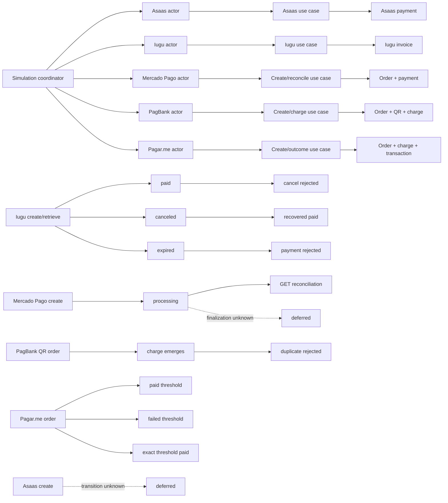

# Provider-Native Scenario Graph

Status: internal discovery graph; not OPP protocol authority.

The graph expands the simulation beyond create/retrieve nodes while preserving
provider-native lifecycle and resource boundaries.

The runtime graph currently exposes 63 nodes: 6 actors, 6 use cases, 11
provider-native resources, 38 executable scenario nodes, and 2 deferred
evidence-gap nodes. Its `snapshot()` method exposes those nodes and edges to
local validation tools. Topology and lifecycle edges are defined in
`src/app/simulation/native_graph.py`. Use-case edges connect actors to
provider-native resources and executable scenario nodes; lifecycle edges then
preserve observed transitions between scenario IDs. Deferred edges remain explicit
so missing evidence is not converted into an invented common state transition.
The MRL adapter passes `observatory_nodes` and `observatory_edges` into the
runtime `Scenario`, so supervision uses this graph instead of the runtime's
three-node actor/scheduler fallback.

The adapter also emits one `graph_route` observation per declared edge. The
observation source is the edge's declared `from` node and its name is the
declared `to` node, matching the runtime observatory's route inference. These
events are the animated beams; declared edges are the persistent structural
beams. Deferred routes use the same visual path but retain `status: deferred`.
For a local inspection of the exact ordered stream, run
`python3 sandboxes/simulation/tools/show_native_graph.py --beams`.

The observatory uses distinct supported runtime kinds and numeric layers:
actors, use cases, provider-native aggregates, scenario projections, and
deferred external-provider nodes. Observatory domains are split into one
`simulation-coordination` domain and one domain per provider, such as
`provider-asaas` and `provider-iugu`. Pix is the current method slice, not the
name of the whole simulation domain.

## Comparison boundary

Cross-provider comparison is limited to report shape, scenario attribution,
graph reachability, and inventories of native observation names. The inventory
does not rename provider events into a shared lifecycle vocabulary. A missing
provider event, retry rule, authentication rule, or response transition remains
an explicit unknown or deferred edge.
