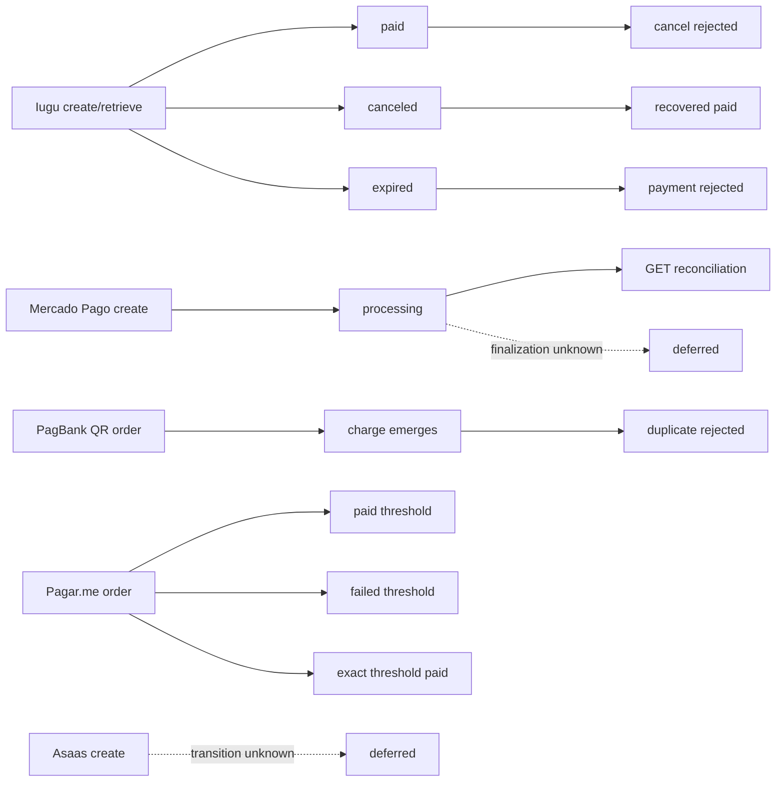

# Provider-Native Scenario Graph

Status: internal discovery graph; not OPP protocol authority.

The graph expands the simulation beyond create/retrieve nodes while preserving
provider-native lifecycle and resource boundaries.

The runtime graph currently exposes 20 nodes: 18 executable scenario nodes and
2 deferred evidence-gap nodes. Its `snapshot()` method exposes those nodes and
edges to local validation tools. Executable edges are defined in
`src/app/simulation/native_graph.py` and every executable edge points to
scenario IDs in the provider scenario registry. Deferred edges remain explicit
so missing evidence is not converted into an invented common state transition.
The MRL adapter passes `observatory_nodes` and `observatory_edges` into the
runtime `Scenario`, so supervision uses this graph instead of the runtime's
three-node actor/scheduler fallback.
